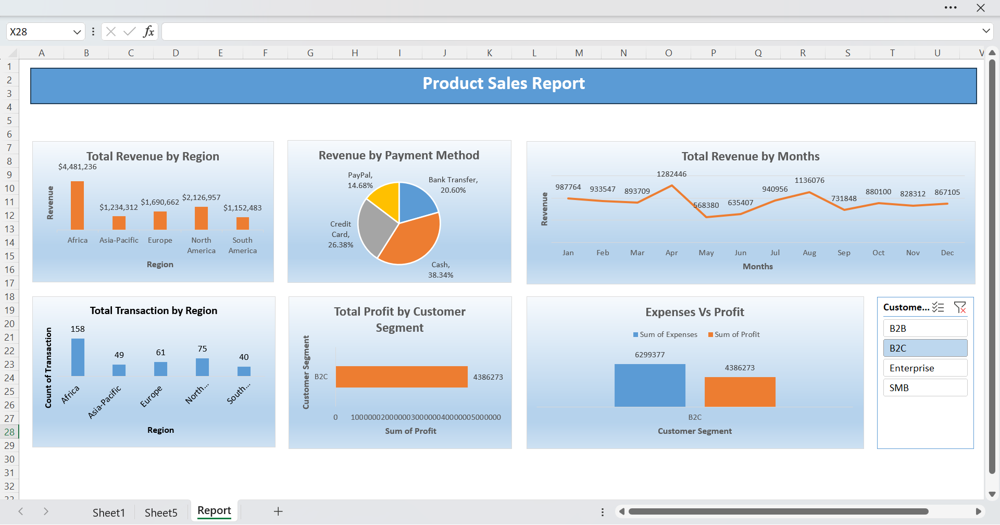

# Product Sales Report (Excel)

A compact Excel project that analyzes product sales transactions and visualizes key KPIs (revenue, expenses, profit) across region, customer segment, product line, and payment method.

## Project goals

- Provide a ready‑to‑use Excel report for sales monitoring.  
- Offer a reproducible template others can adapt to their own sales tables.  
- Keep the repo small and fast by using Git LFS for the workbook.

## ## Preview

## Files

- Product-Sales-Report.xlsx — Source workbook containing the data table and report visuals.
- assets/report-preview.png — A screenshot of the main dashboard for quick preview.

## Dataset

A single transaction table with the following columns:

- Transaction_ID
- Transaction_Date
- Revenue
- Expenses
- Profit
- Category
- Region
- Department
- Product_Line
- Customer_Segment
- Payment_Method
- Discount

Tip: Profit is provided as a column to simplify PivotTable metrics (e.g., margin by Region / Segment / Payment Method).

## How to use

1) Open Product-Sales-Report.xlsx in Excel (desktop recommended).  
2) Data → Refresh All (if you’ve appended or modified rows).  
3) Use filters/slicers to explore trends by Region, Customer_Segment, Product_Line, and Payment_Method.  
4) Right‑click any Pivot → Show Field List to customize views or add KPIs.

## Data dictionary

- Transaction_ID: unique string identifier  
- Transaction_Date: date (YYYY‑MM‑DD)  
- Revenue / Expenses / Profit: numeric (currency)  
- Category / Region / Department / Product_Line / Customer_Segment / Payment_Method: categorical  
- Discount: fraction (0–1)

## License
MIT license

## Author
Dhananjay Kamble • dhanukamble001@gmail.com • https://dhananjay787500.github.io/Portfolio/

